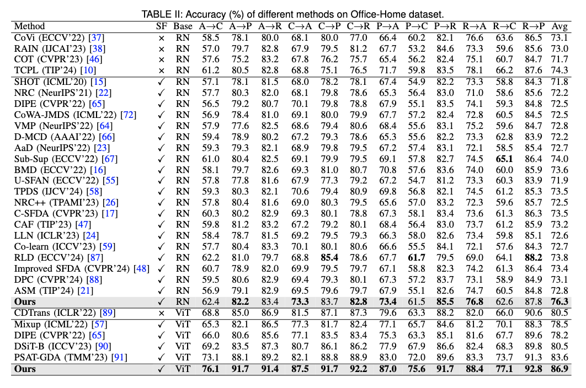
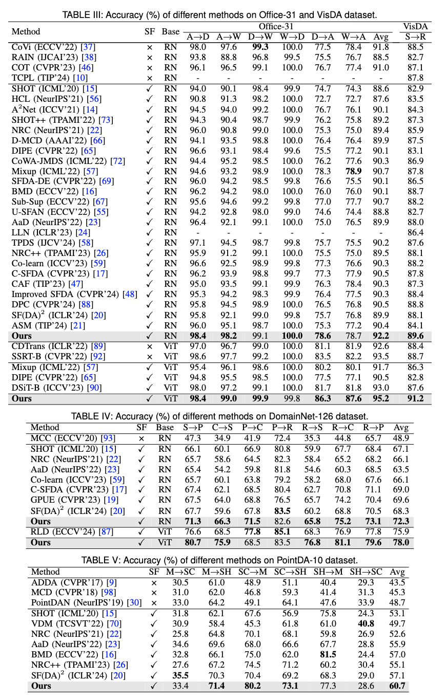
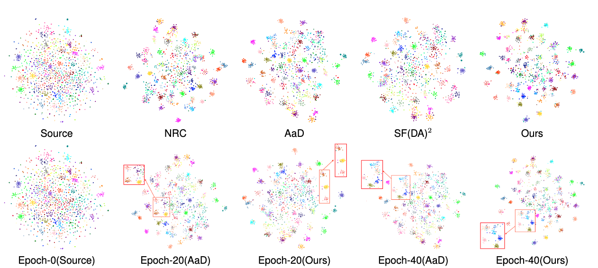

# 📘 [HG-SFDA: HyperGraph Learning Meets Source-free Unsupervised Domain Adaptation]

[](https://ieeexplore.ieee.org/document/11250877)


---

## 🌟 Overview
This repository contains the official implementation of the paper:

> **[HG-SFDA: HyperGraph Learning Meets Source-free Unsupervised Domain Adaptation]**  
> *Jinkun Jiang, Qingxuan Lv, Yuezun Li, IEEE Member, Yong Du, IEEE Senior Member, Junyu Dong, IEEE
Member, Sheng Chen, IEEE Life Fellow, Hui Yu, IEEE Senior Member*  
> It has already been published in *[IEEE Transactions on Image Processing, 2025]*

🎯 **Goal:** Existing methods normally exploit the pair-wise relation among target samples and attempt to discover their correlations by clustering these samples based on semantic features. The drawbacks of these methods include: 1) the pair-wise relation is limited to exposing the underlying correlations of two more samples, hindering the exploration of the structural information embedded in the target domain; and 2) the clustering process only relies on the semantic feature, while overlooking the critical effect of domain shift.

🧠 **Core Idea:** We propose a new SFDA method that exploits the high-order neighborhood relation and explicitly takes the domain shift effect into account. Specifically, we formulate the SFDA as a hypergraph learning problem and construct hyperedges to explore the deep structural and context information among multiple samples. Moreover, we integrate a self-loop strategy into the constructed hypergraph to elegantly introduce the domain uncertainty of each sample. By clustering these samples based on hyperedges, both the semantic feature and domain shift effects are considered. We then describe an adaptive relation-based objective to tune the model with soft attention levels for all samples.

---

## 🏗️ Method Overview

<p align="center">
  
</p>

**Figure 1:** Overview of the proposed architecture.

### 🔍 Key Contributions  
- **Exploring High-order Neighborhood Relation:**  Different from the existing pair-wise relation-based methods, we formulate SFDA as a hypergraph learning problem and explore the high-order neighborhood relations to excavate the underlying structural information.
- **Handling Domain Shift by Self-loop:** With the constructed hypergraph, we design a novel self-loop strategy to elegantly involve the domain shift into optimization.
- **Adaptive Learning Scheme:** We describe an adaptive learning scheme to enhance the mainstream objectives by considering different attention levels.

---

## 📁 Environments

- **PyTorch:** 1.13.1 with CUDA 11.6
- **Scikit-learn:** 0.24.2
- **Other dependencies:**
  - numpy: 1.26.3
  - cvxpy
  - tqdm
---

## 🚀 Training
## Using the ResNet backbone network
### Source Domain
```bash
python train_src.py --dset p2c --home
 ```
### Target Domain
```bash
python train_tar.py --home --dset a2r  --K 3 --file a1b0_seed22 --seed 2022 --gpu_id 3 --alpha 1
 ```
## Using the ViT-B backbone network
### Source Domain
```bash
python office31_src.py --dset a2d --office31
```
### Target Domain
```bash
python office31_tar.py --dset a2d  --K 3 --beta 0.25  --file k3b1
```
---

## 📊 Experimental Results
<p align="center">
  
</p>

**Figure 2:** Accuracy (%) of different methods on Office-Home dataset.

<p align="center">
  
</p>

**Figure 3:** Accuracy (%) of different methods on Office-31, VisDA, DomainNet-126 and PointDA-10 datasets.

---

## 📈 Visualization
<p align="center">
  
</p>

**Figure 4:** Visualization of feature distribution on the C→A in Office-Home.

---

## 🧩 Citation
```bash
@article{jiang2025hg,
  title={HG-SFDA: HyperGraph Learning Meets Source-Free Unsupervised Domain Adaptation},
  author={Jiang, Jinkun and Lv, Qingxuan and Li, Yuezun and Du, Yong and Dong, Junyu and Chen, Sheng and Yu, Hui},
  journal={IEEE Transactions on Image Processing},
  volume={34},
  pages={7542--7557},
  year={2025},
  publisher={IEEE}
}
 ```
---

## 💬 Contact

If you have any questions, please feel free to contact us via email: jiangjinkun@stu.ouc.edu.cn.

---
